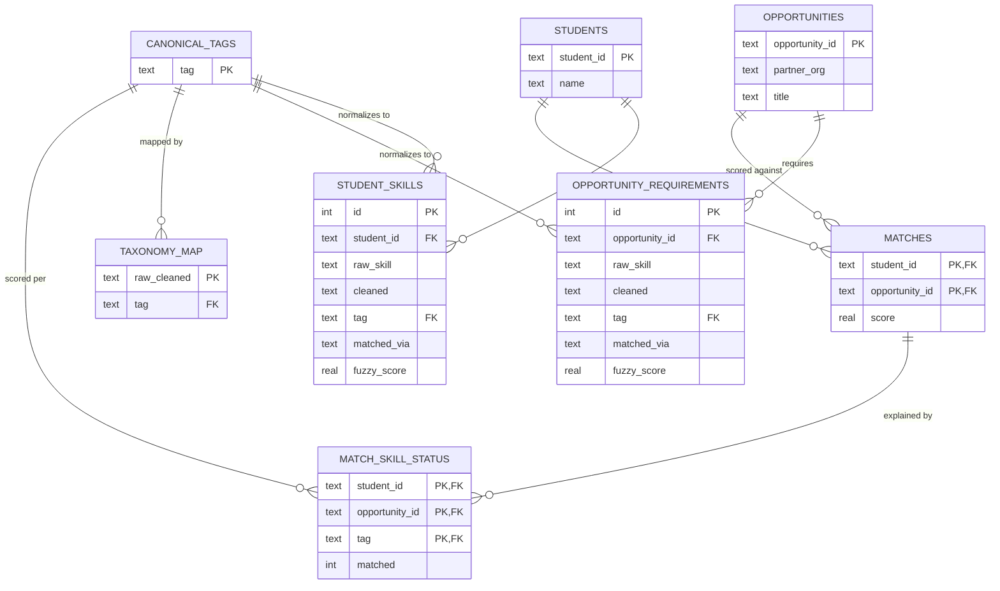
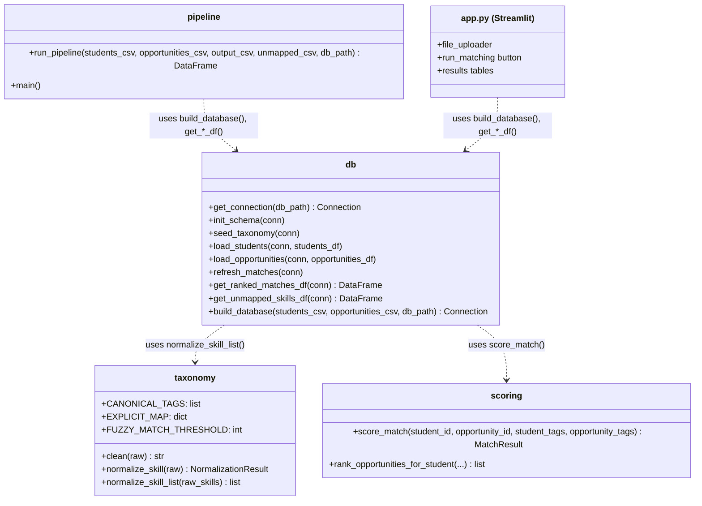
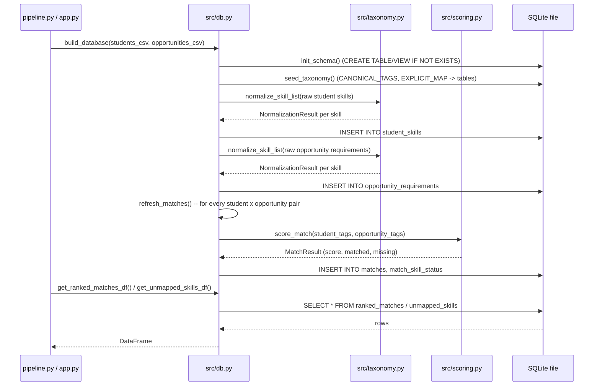

# Weeks 3-4: System Architecture

**Status:** Complete
**Objective (per syllabus):** Flesh out ideas with DB schema, UML diagrams, and API endpoints.
**Work log:** [Week 3](#week-3-914---920----1125-hours) · [Week 4](#week-4-921---927----65-hours)

This work happened earlier than the syllabus's nominal Prototype-phase placement would
suggest: my professor reviewed the PoC and specifically suggested I look into a real
data-storage layer and a UI, so the architecture decisions below were made now rather
than left as open questions until the Pilot (see [Week 2](week-02-requirements-analysis.md),
Section 8, which has been updated to reflect this).

---

## 1. Decisions made

| Decision | Choice | Why |
|---|---|---|
| Data storage | **SQLite** (`db/schema.sql`, `src/db.py`) | Free, zero-setup, single-file, built into Python's standard library (`sqlite3`) -- satisfies NFR-5 (no paid tooling). Gives the project a real, normalized relational schema (this section's deliverable) instead of only flat CSVs, and lets both the pipeline and the Streamlit UI query the same store. |
| Staff-facing interface (FR-12) | **Streamlit** (`app.py`) | A Python-only web UI with no separate frontend/JS build step -- realistic for a solo capstone on a part-time schedule (see Week 2, Section 7, time-availability constraint). Free to run locally, satisfies NFR-5 and NFR-3 (usable without reading code). |
| API endpoints | **N/A -- no REST API** | Streamlit calls the functions in `src/db.py` directly, in the same Python process. There's no second client (mobile app, external system) that would need a network API, and adding one would be unjustified complexity for a single-app, single-user-at-a-time tool with no live-traffic requirement (NFR-6). If a real API consumer ever materializes, this decision should be revisited. |

This resolves the open question that Week 2 had deliberately left for the Pilot: "Final
scope of the staff-facing interface (FR-12) -- CLI vs. Streamlit app." It's Streamlit,
decided now instead of later.

## 2. Data schema (ERD)

The PoC's two flat CSVs (Week 2, Section 6) are now the *input* format only. On each
pipeline run, both CSVs are loaded into the SQLite database below, which is what the
pipeline, the Streamlit app, and any future direct SQL querying all read from. Full DDL
is in [`db/schema.sql`](../db/schema.sql).

Notes on the design:

- `taxonomy_map` moves `EXPLICIT_MAP` from a hardcoded Python dict (in `src/taxonomy.py`)
  into data, directly satisfying NFR-4 (the taxonomy should be extensible without code
  changes). `src/taxonomy.py` itself is unchanged and still used for the actual
  normalization logic (`clean()`, fuzzy matching) -- `seed_taxonomy()` in `src/db.py`
  just copies `CANONICAL_TAGS` / `EXPLICIT_MAP` into these tables so they're queryable
  and so a future admin UI could edit them without touching code.
- `student_skills` / `opportunity_requirements` keep every raw string *and* its
  normalization result (`tag`, `matched_via`, `fuzzy_score`), not just the final tag --
  this is what makes FR-6 (log unmapped skills) and NFR-1 (explainability) queryable
  after the fact, not just visible in a one-time console log.
  `tag` is nullable specifically to represent "couldn't be confidently mapped."
- `matches` and `match_skill_status` are fully recomputed on every pipeline run
  (`refresh_matches()` deletes and reinserts) rather than incrementally updated --
  matching FR-16 (deterministic output): a rerun against the same input always
  produces the same rows from scratch, with no stale leftover state possible.
- Two views, `ranked_matches` and `unmapped_skills`, reassemble the normalized tables
  back into the exact column shapes Week 2, Section 6.1 already specified for
  `output/ranked_matches.csv` and `output/unmapped_skills.csv` -- the external CSV
  contract staff see didn't change, only what produces it did.

## 3. Module structure (class diagram)

`src/taxonomy.py` and `src/scoring.py` are unchanged from the PoC and stay
database-free -- pure functions over plain Python data, which is what keeps them easy
to unit-test in isolation (NFR-8). `src/db.py` is the only new module that knows about
SQLite; it's the sole integration point between the taxonomy/scoring logic and
persistence.

## 4. Sequence diagram: one pipeline run

This is the same normalize -> score -> rank flow from the PoC, now routed through
SQLite rather than staying purely in pandas in memory. Both `pipeline.py` (CLI) and
`app.py` (Streamlit) trigger this identical sequence via `src.db.build_database()`.

## 5. What this changes vs. the PoC

- **Behavior is unchanged.** Verified by hand: rerunning `python -m src.pipeline`
  against the same mock data before and after this refactor produces byte-identical
  `output/ranked_matches.csv` (30 rows, same scores, same matched/missing skills).
  `tests/test_db.py` adds a determinism regression test for this (calling
  `refresh_matches()` twice produces identical results, per FR-16).
- **What's new:** a real, inspectable, queryable data store (`db/schema.sql`), and a
  working staff-facing UI (`app.py`, FR-12) -- both were "planned, not implemented" as
  of Week 2 and are now implemented.
- **What's still the same as the PoC:** the taxonomy (`src/taxonomy.py`) and scoring
  (`src/scoring.py`) logic haven't changed at all -- this phase was purely about
  persistence and interface, not the matching algorithm itself.

## 6. Follow-ups carried forward

- The database file (`db/skills_match.db`) is gitignored, same as `output/*.csv` --
  once real NPower data is loaded it would contain real student PII (NFR-10, NFR-7).
- The Week 2 open question about opportunity capacity/status (Section 8) is unaffected
  by this change -- the schema has no `capacity` or `status` column yet; that's still a
  known gap to close before MVP if real data includes it.
- Sprint 1 items from Week 2 (FR-15 malformed-row handling, explicit tests for FR-14/
  FR-16) are unaffected and still outstanding.
- **Visualization gap (found after the Week 3-4 push, now fixed):** the Streamlit
  per-student view showed only student names and job titles, with no student IDs,
  opportunity IDs, or partner orgs, and `unmapped_skills` showed bare IDs with no
  name. `ranked_matches` now includes `partner_org`, `unmapped_skills` includes
  `entity_name`, and the app's student picker and per-student table show IDs
  alongside names. Next step: check any new charts/views for the same issue
  before adding them.

---

## 7. Work log

Taken from the Tasks tab of my CISC 4900 time log. Dates, hours, and categories match the log; wording is lightly cleaned up for typos.

### Week 3 (9/14 - 9/20) -- 11.25 hours

**9/14/2026 -- Supervisor Discussion (1.5 h)**
- **Task:** Met with Prof. Katherine Chuang for a group discussion. She suggested I implement a UI as well as a way of storing data.
- **Challenges / next steps:** Research her suggestions for my project.
- **Reflection:** Her suggestions were helpful and covered things I hadn't taken into consideration.

**9/15/2026 -- Research, Training, Learning (0.5 h)**
- **Task:** Researched ways to implement Prof. Chuang's data-storage suggestion; decided to go with SQLite.
- **Challenges / next steps:** Research ways of implementing a user interface for the project.
- **Reflection:** This was more of a quick look-up on how I could store data. Good search.

**9/16/2026 -- Research, Training, Learning (0.5 h)**
- **Task:** Researched ways to implement Prof. Chuang's UI suggestion; decided to go with Streamlit.
- **Challenges / next steps:** Coding.
- **Reflection:** Same as the last update.

**9/18/2026 -- Coding (4.0 h)**
- **Task:** Did my first set of coding for the UI of this project.
- **Challenges / next steps:** After implementing the UI I realized that when visualized, some important information is missing, such as student IDs and job names. Next step is to fix that.
- **Reflection:** Minimal issues in coding. AI assisted in this section, as I had done something similar with Gradio but not fully hands-on or from scratch.

**9/19/2026 -- Coding (4.0 h)**
- **Task:** Did my first set of coding for the SQL storage of this project.
- **Reflection:** It was tough picking between SQLite and PostgreSQL, but all in all SQLite was the best choice.

**9/20/2026 -- Documentation (0.75 h)**
- **Task:** Updated documentation for weekly updates in GitHub.
- **Challenges / next steps:** More coding.
- **Reflection:** Good progress so far; I might be able to finish early.

### Week 4 (9/21 - 9/27) -- 6.5 hours

**9/22/2026 -- Research, Training, Learning (2.0 h)**
- **Task:** Researched effective ways to fix the visual bugs of the project.
- **Challenges / next steps:** Implement the research found.
- **Reflection:** Found a simple fix.

**9/24/2026 -- Research, Training, Learning (2.0 h)**
- **Task:** A main aspect of this project is a pipeline for not just partner opportunities but also courses. Researched ways to implement this.
- **Challenges / next steps:** Implement this.
- **Reflection:** I only have the syllabus for courses; if it's not enough I will ask my supervisor for more info.

**9/25/2026 -- Testing & Debugging (1.5 h)**
- **Task:** Implemented the fixes discussed on 9/22/26.
- **Challenges / next steps:** Implement the issue raised on 9/24/26.
- **Reflection:** Not much needed to change and it was a pretty simple fix.

**9/26/2026 -- Documentation (1.0 h)**
- **Task:** Documented the changes made in the GitHub repo.
- **Challenges / next steps:** Implement the issue raised on 9/24/26.
- **Reflection:** I will implement the changes raised on 9/24/26 next week.

**Carried into Week 5:** implement the course pipeline researched on 9/24 (matching students to NPower courses, not just partner opportunities).

